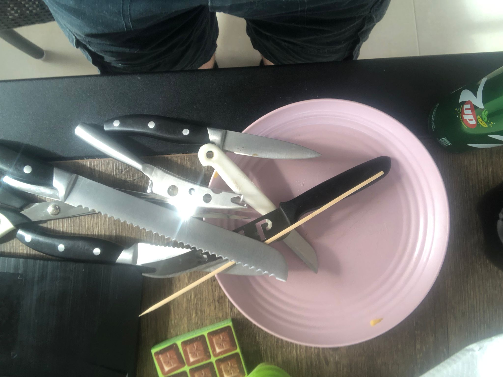

# Reflectie

## Screen cast
[YouTube video](https://youtu.be/UkoBGeDzEzI)

https://youtu.be/UkoBGeDzEzI

## Doel
Het doel van mijn project is om te herkennen of er een scherp of niet scherp object op beeld is. 

## I/O
De input zijn de videobeelden van mijn webcam, de output is een voorspelling of wat er op camera veilig of scherp is. 

## Library/ Algoritme
Er word gebruik gemaakt van de ML5 library en van de FeatureExtractor class uit de library.

## Succes?
Het doel is niet behaald. Dit komt hoogst waarschijnlijk door slechte trainginsdata. Dit kan ik verkomen door mezelf uit het beeld te houden en een 1 kleurige of consistente achtergrond te hebben.
Ik heb wel geleerd hoe de feature extractor werkt en wat je moet voorkomen. De kennis kan ik gebruiken voor mijn eindproject als wij onze eigen image recognizing model willen trainen door het model van ml5 te retrainen. 

## Moeite
Ik vond het opzetten van de feature extractor eenvoudig door dat er veel hulpmiddelen online beschikbaar waren. Het moeilijke vond ik om het model te trainen door mijn browser limitaties. Ik heb meerdere keren mijn browser gecrasht door te veel foto's te maken, hierdoor verloor ik ook mijn trainingsdata.
