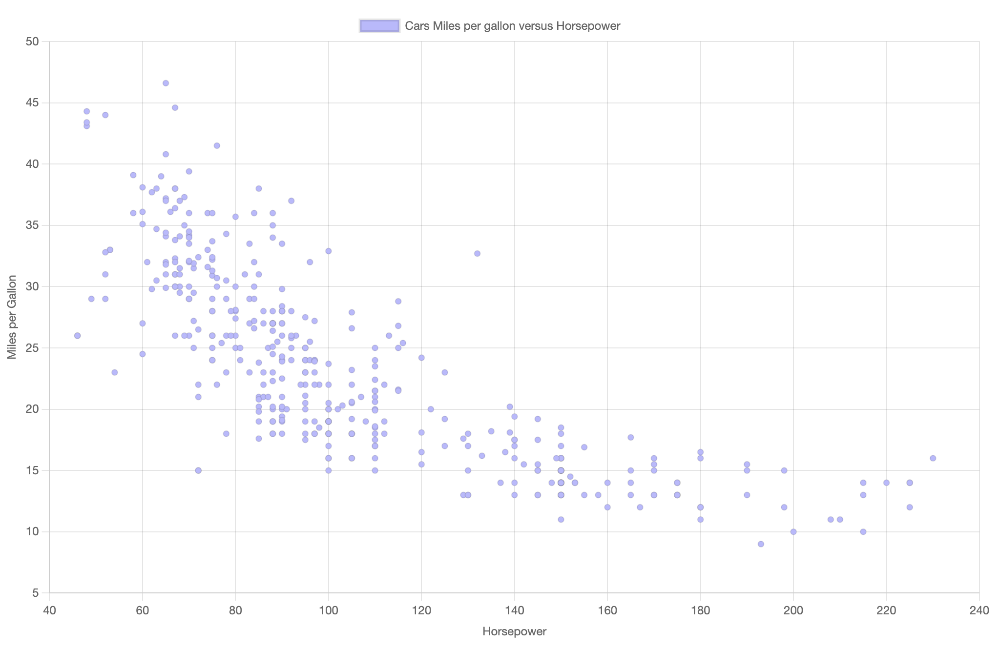
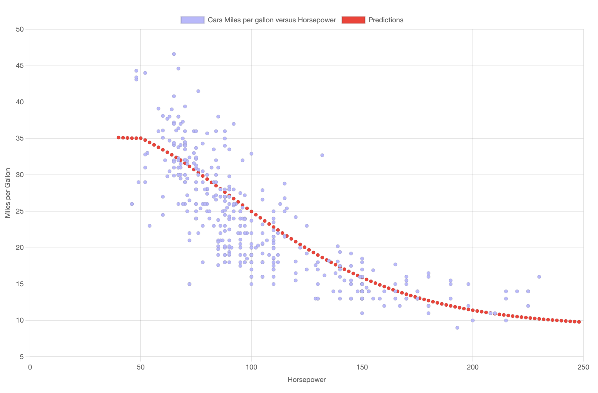

# Week 6

## Neural Networks


Een neural network is in staat om complexe patronen in data te vinden. Je kan een neural network gebruiken voor:

- **Classification** : het algoritme voorspelt een label, bv: "survived" of "died"
- **Regression** : het algoritme voorspelt een getal, bv: "temperatuur", "prijs", "luchtvervuiling"

In deze oefening werken we met regression. Ook gaan we kijken hoe we data kunnen tekenen in een grafiek. We gaan de voorspelling ook tekenen!

👨🏻‍💻👩🏽‍💻 Je kan de oefening downloaden uit deze repository of [live meedoen op glitch](https://glitch.com/edit/#!/ml5-cars-tutorial)

<br>
<br>
<br>

# ML5 Neural Network

[ML5](https://learn.ml5js.org/#/reference/neural-network) is een gebruiksvriendelijke library om snel met Machine Learning en Neural Networks aan de slag te kunnen. De onderliggende techniek is [TensorFlow](https://www.tensorflow.org/js/).

### 🚗  Data 

In dit voorbeeld gebruiken we hardcoded data, dit zijn `cars` met een `horsepower` en `mpg` (miles per gallon) waarde. 

```javascript
let data = [
    { horsepower: 130, mpg: 18 },
    { horsepower: 165, mpg: 15 },
    { horsepower: 225, mpg: 14 },
    { horsepower: 97, mpg: 18 },
    { horsepower: 88, mpg: 27 },
    { horsepower: 193, mpg: 9 },
    { horsepower: 80, mpg: 25 }
]
```

<br>
<br>
<br>

## 🔥 Neural Network

We willen de "miles per gallon" voorspellen van een auto waarvan we alleen de horsepower weten. Omdat we een *getal* voorspellen moeten we de `task:regression` doorgeven.

```javascript
const options = { task: 'regression', debug: true }
const nn = ml5.neuralNetwork(options)
```
<br>
<br>
<br>

## Data toevoegen aan Neural Network

Nu kan je data gaan toevoegen met de `addData` functie. 

> ⚠️ Trainingdata in een neural network voor regression bestaat altijd uit getallen!

Let op dat je eerst de data shuffled, om te voorkomen dat er een patroon herkend wordt in de volgorde van je data. We gebruiken de `horsepower` van de auto om te voorspellen wat de `mpg` gaat zijn. Daarna normaliseren we de data om te zorgen dat alle kolommen even belangrijk zijn.

```javascript
// shuffle
data.sort(() => (Math.random() - 0.5))

// een voor een de data toevoegen aan het neural network
for (let car of data) {
    nn.addData({ horsepower: car.horsepower }, { mpg: car.mpg })
}

// normalize
nn.normalizeData()
```
<br>
<br>
<br>

## Trainen

Bij het trainen moet je aangeven hoeveel `epochs` dit moet duren. Hier kan je zelf mee experimenteren.

```javascript
nn.train({ epochs: 10 }, () => finishedTraining()) 

function finishedTraining(){
    console.log("Finished training!")
}
```
<br>
<br>
<br>

## Prediction

Met de `predict` functie kunnen we nieuwe data voorspellen! Maak een nieuwe `car` met een `horsepower` van `90`, waarvan we niet de `mpg` weten:

```javascript
async function finishedTraining() {
    const testCar = { horsepower: 90 }

    const results = await nn.predict(testCar)
    console.log(results)

    const prediction = results[0].value
    console.log(`Geschat verbruik: ${prediction}`)
}
```

<br>
<br>
<br>
<br>


# Scatterplot

Een scatterplot kan je gebruiken om te zien hoe je data in elkaar zit. In deze afbeelding zie je data van 400 auto's. Zie je een verband tussen `horsepower` en `miles per gallon` ?



Je kan een scatterplot tekenen met de voorbeeldcode uit deze repository. 

Een scatterplot verwacht een array met x,y coordinaten, bijvoorbeeld: `[{x: 20, y: 30}, {x:40, y:50}]`. Je kan deze array aanmaken aan de hand van de bestaande `data` met de `.map()` functie.

```javascript
// scatterplot
import { createChart } from "./scatterplot.js"

const chartdata = data.map(car => ({
    x: car.horsepower,
    y: car.mpg,
}))

// chartjs aanmaken
createChart(chartdata)
```


<br>
<br>
<br>

## Prediction tekenen als lijn



We kunnen voor elke mogelijke `horsepower` (waarden van 40 tot 250) een prediction doen, en die toevoegen aan een array. 

```javascript
const chartresults = []

for(let hp = 40; hp<250; hp+=2) {
    const results = await nn.predict({horsepower:hp})
    chartresults.push({ x: hp, y: results[0].value})
}
```
Deze array kunnen we tekenen in de scatterplot! Dit illustreert of het neural network de complexiteit in de data kan herkennen.

```javascript
import { updateChart } from "./scatterplot.js"
updateChart("Predictions", chartresults)
```


<br>
<br>
<br>

# Praktijkopdracht week 6

Bij de praktijkopdracht van week 6 ga je deze oefening maken met een CSV file, en kijken of je meer data kan gebruiken om te trainen.

Ook ga je het model opslaan, zodat je niet telkens opnieuw hoeft te trainen.

[Ga naar de praktijkopdracht](./praktijkopdracht.md)

<br>
<br>
<br>

### ⚠️ Async await

> Let op het gebruik van `async await`. Zodra je ergens `await` nodig hebt, moet je zorgen dat dit binnen een `async` functie staat!

```javascript
async function doSomething() {
    let result = await doComplicatedThing()
    console.log("ready!")
}
```

<br>
<br>
<br>
<br>


## Documentatie

- [🔥 ML5 Neural Networks in Javascript](https://learn.ml5js.org/#/reference/neural-network)
- [ChartJS Scatterplot code voorbeeld](https://github.com/HR-CMGT/PRG08-2021-2022/blob/main/snippets/scatterplot.md)
- [ChartJS Scatterplot documentatie](https://www.chartjs.org/docs/latest/charts/scatter.html)

## Externe links

- [📺 Crash Course Neural Networks](https://www.youtube.com/watch?v=JBlm4wnjNMY)
- [📺  But what is a neural network?](https://www.youtube.com/watch?v=aircAruvnKk)
